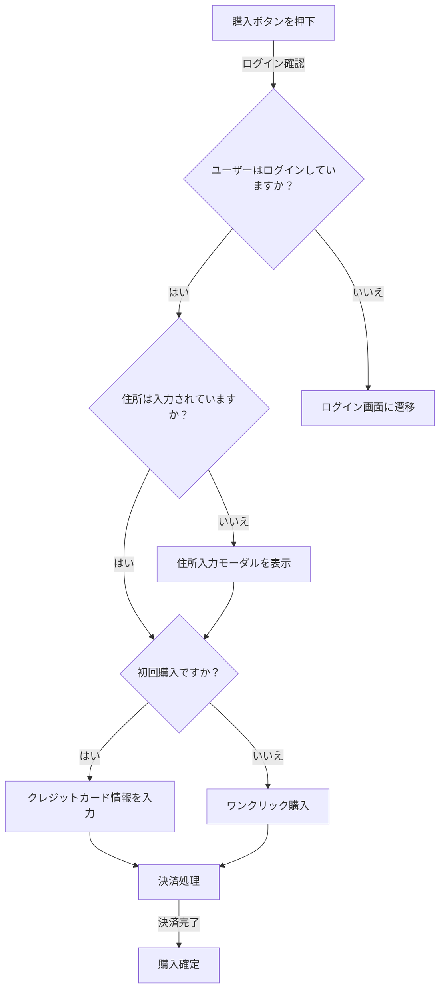

```mermaid
graph TD
A[購入ボタンを押下] -->|ログイン確認| B{ユーザーはログインしていますか？}
B -->|はい| C{住所は入力されていますか？}
B -->|いいえ| D[ログイン画面に遷移]
C -->|いいえ| E[住所入力モーダルを表示]
C -->|はい| F{初回購入ですか？}
E --> F
F -->|はい| G[クレジットカード情報を入力]
F -->|いいえ| H[ワンクリック購入]
G --> I[決済処理]
H --> I
I -->|決済完了| J[購入確定]
```
